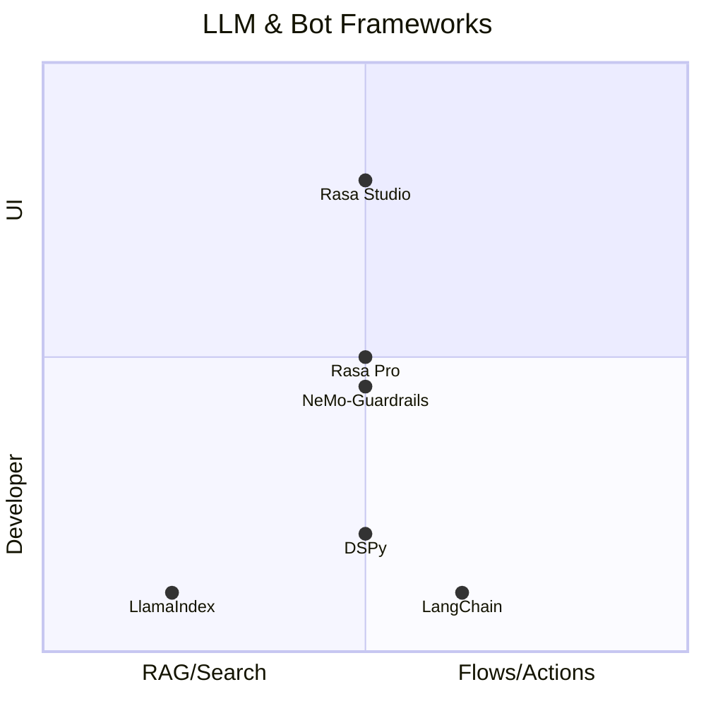

# Product Positioning

```mermaid
quadrantChart
    title LLM & Bot Frameworks
    y-axis Developer --> UI
    x-axis RAG/Search --> Flows/Actions
    Rasa Studio: [0.50, 0.8]
    DSPy:       [0.50, 0.20]
    Rasa Pro:        [0.50, 0.50]
    NeMo-Guardrails: [0.50, 0.45]
    LangChain:  [0.65, 0.10]
    LlamaIndex: [0.20, 0.10]
```
